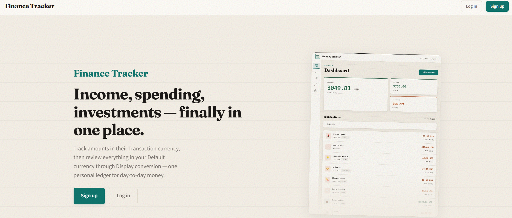
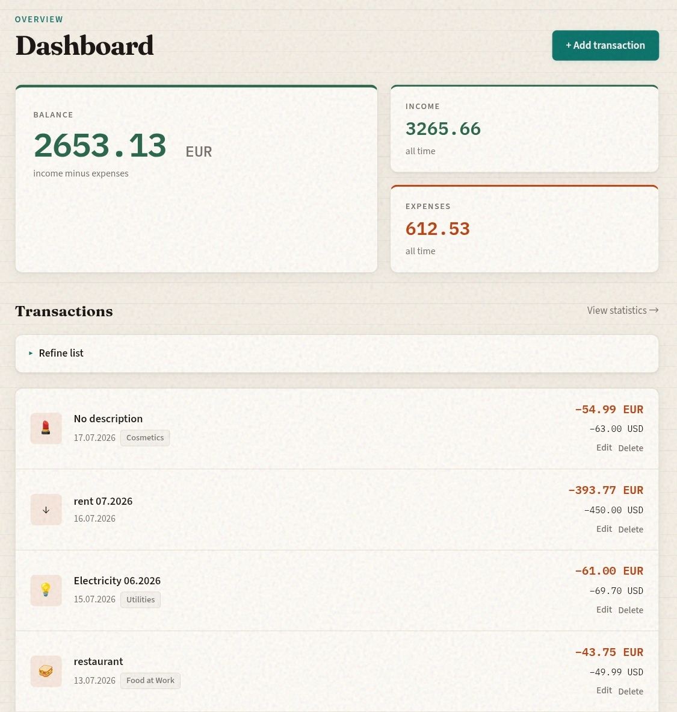
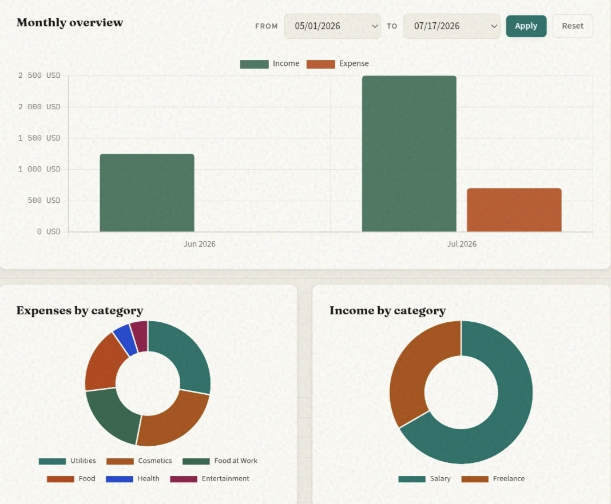
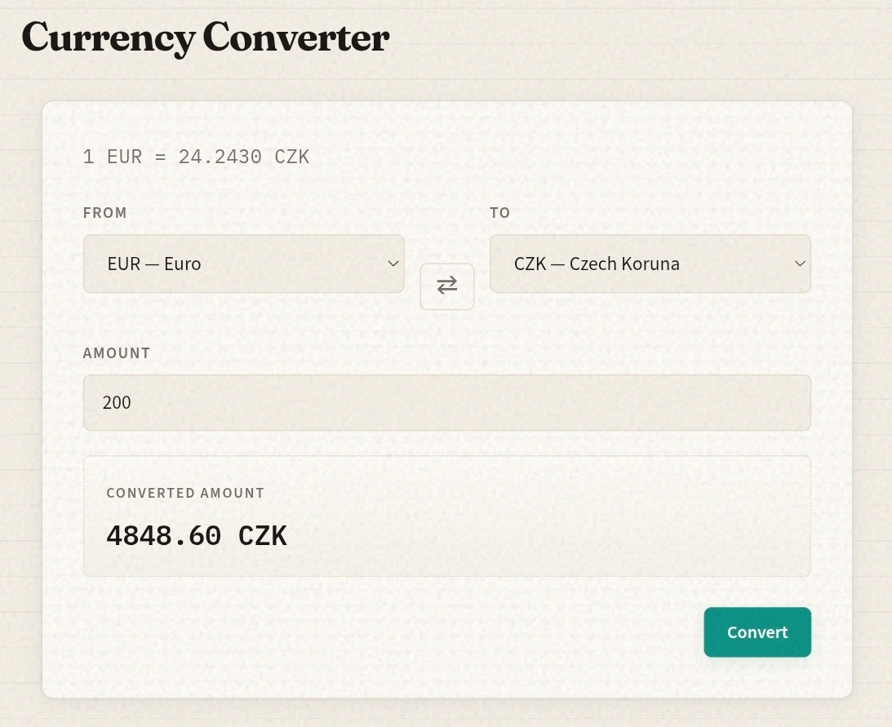
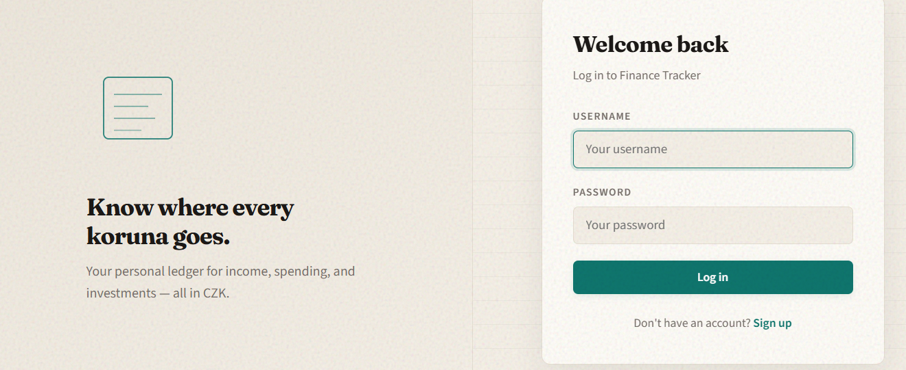
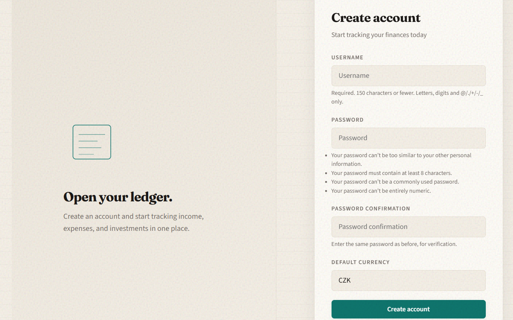
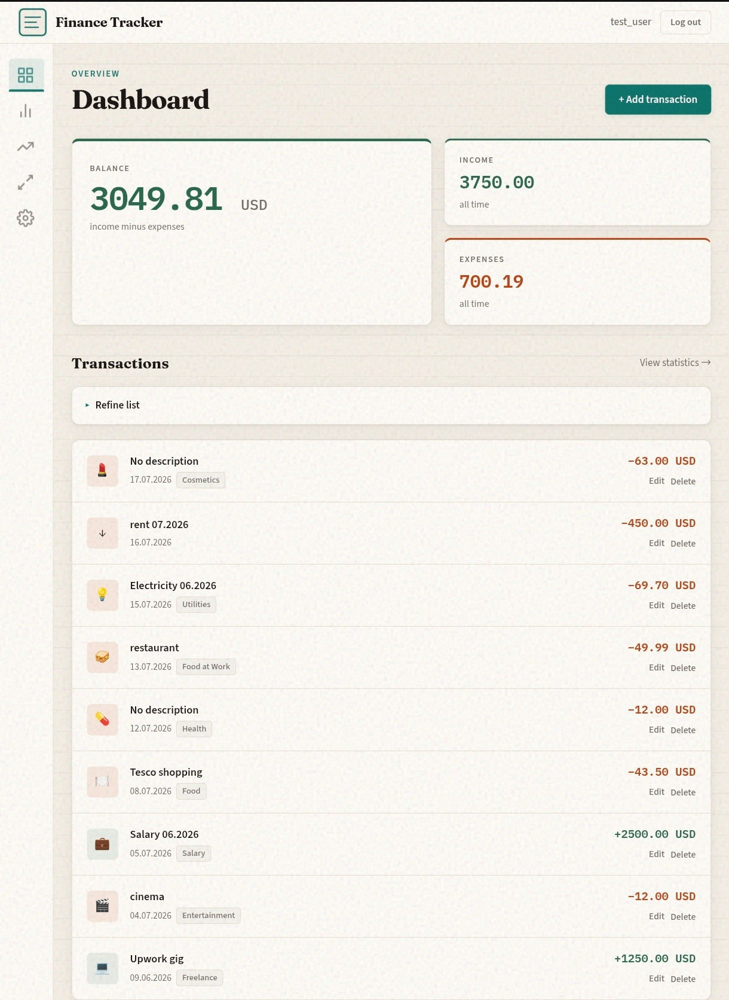

# Finance Tracker

A personal finance web app for tracking income, expenses, and investments. Transactions are stored in their **Transaction currency**; the dashboard and statistics show amounts in each user's **Default currency** via on-the-fly **Display conversion**. Built with Django, PostgreSQL (Supabase), and a Warm Ledger / Night Ledger UI (plus System preference) served via WhiteNoise.

**Repository:** [github.com/petkov93/finance-tracker](https://github.com/petkov93/finance-tracker)



---

## Screenshots

**Dashboard** · **Statistics** · **Converter**







**Log in** · **Sign up**





Full dashboard capture (also used on the landing hero):



---

## Features

### Public landing
- Marketing home at `/` for guests (hero, feature frames, signup CTA)
- Logged-in visitors hitting `/` go straight to the dashboard at `/dashboard/`

### Dashboard
- Overview of **balance**, total income, and total expenses (all time), summed in your default currency
- Recent transactions with edit/delete
- When a transaction's Transaction currency differs from your Default currency, the converted amount is shown prominently with the original as a footnote
- Amounts use locale-aware number formatting from the browser `Accept-Language` header

### Transactions
- Add **income** or **expense** entries in any [Frankfurter-supported](https://frankfurter.dev) currency
- Currency picker defaults to your profile default on new entries
- Optional category and description
- Categories filtered by type (income vs expense) on the form

### Statistics
- Summary cards (net balance, income, expense counts) after display conversion (historical rates for past dates, latest for today and future)
- **Monthly bar chart** with configurable date range
- **Pie charts** for expenses and income by category — all totals in your default currency
- Chart colors follow the active appearance (Warm / Night), including live System OS changes
- Summary cards and chart labels share the same locale-aware money formatter as the dashboard

### Investments
- Separate view for **invested** vs **profit** amounts (**CZK only** — no currency picker or conversion)
- Portfolio value (**profit − invested**) — net gain or loss relative to capital put in
- Same list/edit/delete flow as transactions
- Amounts use the same locale-aware money formatting as other pages

### Currency converter
- Standalone calculator at `/converter/` using **latest** exchange rates only
- Default pair CZK → EUR; your last-used pair is remembered in the session
- Independent of your profile default currency and transaction display logic
- Rate line and converted result use the shared locale-aware money formatter

### Accounts
- Register with a required **default currency** (pre-selected from browser locale when it maps confidently to a supported code)
- Change default currency later in **Settings**
- Log in, log out; each user only sees their own data

### Appearance
- **Settings → Appearance** with three choices: **Warm Ledger** (cream-paper light), **Night Ledger** (same-family dark), and **System** (follow OS light/dark)
- Preference is stored on the user profile (default **System** for new accounts and guests)
- Instant apply from swatch cards; FOUC-safe cookie keeps the first paint aligned
- System updates live when the OS theme changes; Statistics charts follow CSS theme tokens

### Admin
- Django admin at `/admin/` for categories, transactions, investment entries, and user profiles (including theme)

---

## Tech stack

| Layer | Technology |
|-------|------------|
| Backend | Django 5.x |
| Database | PostgreSQL (Supabase) or SQLite locally |
| Auth | Django built-in users |
| Static files | WhiteNoise |
| Production server | Gunicorn |
| Deploy | [Render](https://render.com) (`render.yaml`) |

---

## Project structure

```
finance-tracker/
├── config/                 # Django settings, URLs, WSGI
├── financetracker/         # Main app
│   ├── img/
│   │   ├── landing/        # Landing / README product screenshots
│   │   └── sample/         # Landing page, login, register captures
│   ├── management/commands/
│   │   └── seed_categories.py   # Default categories (empty DB only)
│   ├── migrations/
│   ├── static/financetracker/
│   │   ├── css/style.css         # Warm / Night design tokens
│   │   ├── img/landing/          # Served landing screenshots
│   │   └── js/
│   │       ├── theme.js          # Live System preference + themechange events
│   │       └── money.js          # Locale-aware amount formatting for charts/converter
│   ├── templatetags/
│   │   └── money.py              #  /  tags
│   ├── templates/financetracker/
│   ├── models.py           # Category, Transaction, InvestmentEntry, UserProfile, ExchangeRate, IOU, IOURepayment
│   ├── context_processors.py     # theme_preference + display_locale + IOU nav badge
│   ├── middleware.py             # Sync ft_theme cookie from profile
│   ├── services/
│   │   ├── currency.py                 # Frankfurter rates, DB persistence, sync, convert
│   │   ├── display_conversion.py       # Batch display conversion for dashboard/statistics
│   │   ├── iou.py                      # IOU create/repay/close/reopen and Total adjustment
│   │   ├── money_format.py             # Accept-Language locale + amount formatting
│   │   └── statistics_aggregation.py   # Month/category series for charts
│   ├── views.py
│   ├── forms.py
│   └── urls.py
├── manage.py
├── requirements.txt
├── render.yaml             # Render Blueprint
├── run.ps1                 # Local dev (Windows)
├── run.sh                  # Local dev (Linux/macOS)
├── .env.example            # Environment template (commit this)
└── .env                    # Your secrets (never commit)
```

---

## Local development

### Prerequisites
- Python 3.12+
- A [Supabase](https://supabase.com) project (recommended) or SQLite fallback if `SUPABASE_URL` is unset

### 1. Clone and install

```bash
git clone https://github.com/petkov93/finance-tracker.git
cd finance-tracker
python -m venv .venv
```

**Windows (PowerShell):**
```powershell
.\.venv\Scripts\Activate.ps1
pip install -r requirements.txt
```

**Linux / macOS:**
```bash
source .venv/bin/activate
pip install -r requirements.txt
```

### 2. Environment variables

Copy the example file and fill in your values:

```bash
cp .env.example .env
```

| Variable | Description |
|----------|-------------|
| `SUPABASE_URL` | PostgreSQL connection URI (Supabase → **Session pooler**) |
| `SECRET_KEY` | Django secret key (long random string) |
| `DJANGO_DEBUG` | `true` for local dev |

Optional locally: `ALLOWED_HOSTS`, `CSRF_TRUSTED_ORIGINS` (defaults work for `localhost`).

**Supabase URI tip:** If your password has special characters, paste the URI as-is; the app URL-encodes it automatically.

### 3. Run the app

**Windows:**
```powershell
.\run.ps1
```

**Linux / macOS:**
```bash
bash run.sh
```

This will:
1. Run database migrations
2. Seed **default categories** only if the category table is empty
3. Collect static files
4. Start the dev server at `http://127.0.0.1:8000`

### 4. Create a user

Open the app → **Sign up**, or use the admin:

```bash
python manage.py createsuperuser
```

Then visit `/admin/`.

---

## Multi-currency

### Data model

| Concept | Where it lives | Purpose |
|---------|----------------|---------|
| **Default currency** | `UserProfile.default_currency` (one per user) | Unit of account for dashboard and statistics |
| **Theme preference** | `UserProfile.theme` (`warm` / `night` / `system`) | Appearance choice; System resolves from the OS |
| **Transaction currency** | `Transaction.currency` | Native currency the amount was actually paid or received in |
| **Display conversion** | Computed at read time (not stored) | Converts transaction amounts into the user's default currency for display and aggregation |

Existing users and transactions are migrated automatically: every user gets a profile with default **CZK**, and every existing transaction is backfilled as CZK. Theme defaults to **System**. Users created via `createsuperuser` receive a lazy profile (CZK + System) on first login.

### Registration and settings

- **Registration** requires choosing a default currency from the Frankfurter-supported list. Client-side logic reads `navigator.language` and pre-selects the picker when the region maps unambiguously to a supported ISO code; otherwise the picker stays empty until the user chooses. New accounts start with theme **System**.
- **Settings** includes sections to update default currency and **Appearance** (Warm Ledger / Night Ledger / System). Currency changes re-render dashboard and statistics on the next page load; theme swatches apply immediately.

### Transaction entry

- Each transaction stores `amount` and `currency` together — the amount is always in that row's native currency.
- The currency picker on add/edit defaults to the user's profile default on new entries.
- Investments are unchanged: amounts remain CZK-only with no currency field.

### Display conversion behavior

Dashboard and statistics do **not** sum raw `amount` values across mixed currencies. Instead, the display-conversion layer batches unique `(from, to, transaction_date)` rate lookups, converts each row, then aggregates.

- **Same currency** as default: one formatted amount, no footnote.
- **Different currency**: primary amount in default currency; secondary footnote shows the original native amount.
- **Degraded mode**: if no usable exchange rate exists at all (no stored snapshot and Frankfurter unreachable), converted totals are omitted, rows show native amounts, and a warning banner is shown.
- **Stale rates**: when today's live sync failed but an earlier stored snapshot exists, totals and charts still render using those rates and an info banner shows the snapshot date.

### Money formatting

Displayed amounts (dashboard, statistics, investments, converter) use a shared locale-aware formatter so grouping and decimal separators follow the browser language:

- **Server-rendered amounts** resolve locale from the request `Accept-Language` header (`display_locale` context processor + `` / `` tags).
- **Client-side charts and converter JS** use the same `display_locale` via `FinanceTrackerMoney` in `money.js`, so SSR totals and chart ticks stay consistent on a page.
- Format is a localized number plus an ISO currency code (for example `1 234,56 CZK` or `1,234.56 EUR`).

### Exchange-rate policy

Rates come from the [Frankfurter API](https://frankfurter.dev) and are **persisted in the database** (`ExchangeRate` table, EUR-base snapshots). The currency service (`financetracker/services/currency.py`) applies:

| Transaction date | Rate used |
|------------------|-----------|
| Past (`< today`) | Historical rate for that date |
| Today | Latest available rate |
| Future (`> today`) | Latest available rate (same as today) |
| Same `from`/`to` pair | `1` — no HTTP call |

**Weekends and holidays:** when Frankfurter has no published rate for the exact date, the service walks back up to seven days to the nearest prior published rate. No rate-date hint is shown in the UI.

**Startup sync:** when the app boots (after migrations are available), it bulk-fetches today's rates if `last_successful_sync_date` is before today. A database-backed lock prevents multiple Gunicorn workers from double-fetching on wake. Sync failures are logged and do not block boot — stale stored rates continue to serve traffic.

**Read-time refresh:** the first latest-rate lookup also triggers sync when today's snapshot is stale, covering long-lived processes without a separate cron job.

**Stale fallback:** when Frankfurter is unreachable but an earlier snapshot exists, `get_rate` returns the most recent stored rate and carries the snapshot date as stale metadata. Dashboard, statistics, and the converter show an info banner; totals remain visible.

**Manual sync:**

```bash
python manage.py sync_exchange_rates
```

**Converter page:** always uses latest rates only (`get_rate` without a date). It does not use transaction-date historical lookups.

There is **no in-memory rate cache** — the database is the sole durable cache layer.

---

## Default categories

On first run (empty database), these categories are created automatically:

| Income | Expense |
|--------|---------|
| Salary 💼 | Food 🍽️ |
| Freelance 💻 | Food at Work 🥪 |
| Other Income 💰 | Health 💊, Transport 🚗, Rent 🏠, … |

If **any** category already exists, seeding is skipped — your admin changes are never overwritten on restart.

To seed manually:
```bash
python manage.py seed_categories
```

---

## Database

- **Production / recommended:** PostgreSQL on Supabase (`SUPABASE_URL` in environment)
- **Local fallback:** SQLite (`db.sqlite3`) when `SUPABASE_URL` is not set

Migrations:
```bash
python manage.py migrate
```

---

## Deploy on Render

1. Push this repo to GitHub (already done if you cloned from [petkov93/finance-tracker](https://github.com/petkov93/finance-tracker)).
2. [Render](https://render.com) → **New** → **Blueprint** → connect the repo (uses `render.yaml`).
3. Set these **Environment** variables in the Render dashboard:

| Variable | Example |
|----------|---------|
| `SUPABASE_URL` | `postgresql://...` (session pooler) |
| `SECRET_KEY` | long random string |
| `DJANGO_DEBUG` | `false` |
| `ALLOWED_HOSTS` | `your-app.onrender.com` |
| `CSRF_TRUSTED_ORIGINS` | `https://your-app.onrender.com` |

4. Deploy. Render runs migrate, seed (if empty), collectstatic, and Gunicorn.

Health check: `GET /health/` → `{"status": "ok"}`

---

## Useful commands

```bash
python manage.py migrate
python manage.py seed_categories
python manage.py sync_exchange_rates
python manage.py collectstatic --noinput
python manage.py createsuperuser
python manage.py runserver
python manage.py check --deploy   # production settings check
```

### Tests

Tests use an in-memory SQLite database (no Supabase required):

```bash
python manage.py test
```

**Windows:** `.\test.ps1`  
**Linux / macOS:** `bash test.sh`

Install dev dependencies first for coverage (see below):

```bash
pip install -r requirements-dev.txt
```

### Coverage

Run tests with coverage measurement and a terminal report:

```bash
coverage run manage.py test
coverage report
```

**Windows:** `.\cover.ps1`  
**Linux / macOS:** `bash cover.sh`

Optional HTML report (open `htmlcov/index.html` in a browser):

```bash
coverage html
```

---

## Security notes

- Never commit `.env` — it is in `.gitignore`
- Use a strong `SECRET_KEY` in production
- Registration is open by default; restrict via admin or disable `register` URL if you deploy publicly

---

## License

MIT — see [LICENSE](LICENSE).
